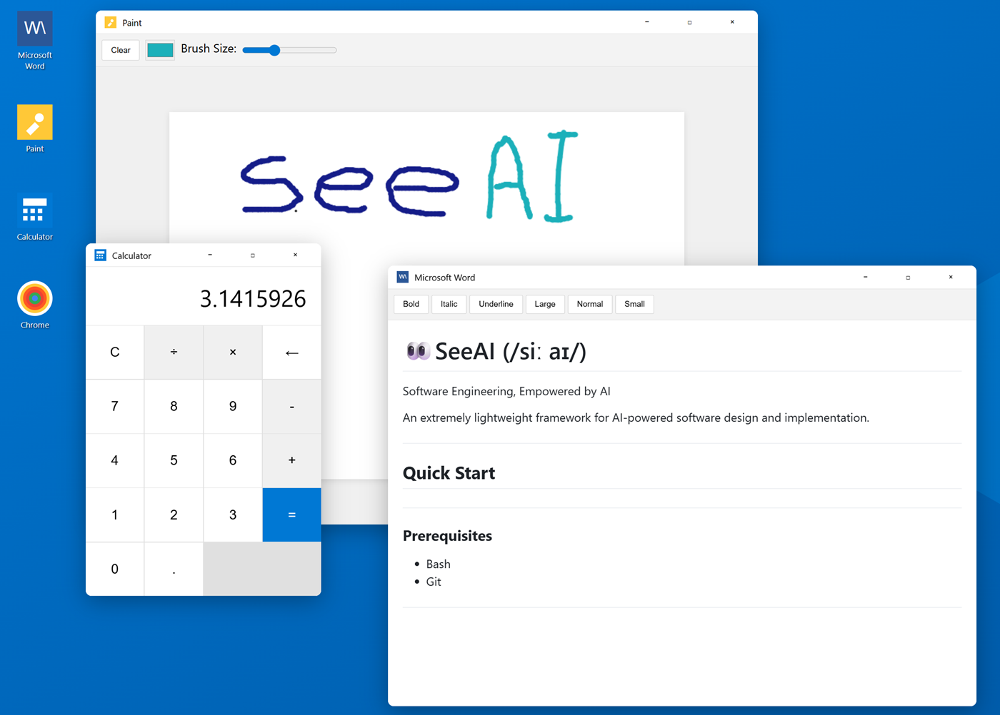

# 👀SeeAI (/siː aɪ/)

Software Engineering, Empowered by AI

An extremely lightweight framework for AI-powered software design and implementation.

## Quick Start

### Prerequisites

- Bash
- Git

Windows: install [Git for Windows](https://git-scm.com/download/win) to get both Git and Git Bash.

### Install

Run the command below for your preferred AI agent and installation scope.

Installation scopes:

- User scope: Copies Commands (design.md, gherkin.md) to your home directory, available across all projects
- Project scope: Uses Actions and Specs from specs/agents/seeai/ directory, available only in this project. Actions are invoked through Natural Language Invocation via triggering instructions in AGENTS.md or CLAUDE.md

<details>
<summary>auggie</summary>

User scope (main branch):
```bash
curl -fsSL https://raw.githubusercontent.com/untillpro/seeai/main/scripts/seeai.sh | bash -s install main --agent auggie --scope user
```

Project scope (main branch):
```bash
curl -fsSL https://raw.githubusercontent.com/untillpro/seeai/main/scripts/seeai.sh | bash -s install main --agent auggie --scope project
```

</details>

<details>
<summary>claude</summary>

User scope (main branch):
```bash
curl -fsSL https://raw.githubusercontent.com/untillpro/seeai/main/scripts/seeai.sh | bash -s install main --agent claude --scope user
```

Project scope (main branch):
```bash
curl -fsSL https://raw.githubusercontent.com/untillpro/seeai/main/scripts/seeai.sh | bash -s install main --agent claude --scope project
```

</details>

<details>
<summary>copilot</summary>

User scope (main branch):
```bash
curl -fsSL https://raw.githubusercontent.com/untillpro/seeai/main/scripts/seeai.sh | bash -s install main --agent copilot --scope user
```

Project scope (main branch):
```bash
curl -fsSL https://raw.githubusercontent.com/untillpro/seeai/main/scripts/seeai.sh | bash -s install main --agent copilot --scope project
```

</details>

### List installed files

```bash
curl -fsSL https://raw.githubusercontent.com/untillpro/seeai/main/scripts/seeai.sh | bash -s list
```

### Describe your problem in a written form

- cd `<your-project-folder>`
- Prepare a problem description
  - If you have a simple problem, like "Creating a clone of the Windows 11 desktop", describe like this: [desktop.md](examples/explorer/desktop.md)

### Design the solution

- Start the CLI agent (auggie, claude, copilot)
- Invoke the design command with your problem file tagged (`@` for claude/auggie, `#` for copilot):

```text
> /seeai:design @desktop.md

or

> /seeai:design #desktop.md
```

- As a result you will get the [desktop-design.md](examples/explorer/desktop-design.md)
- Now see AI, 👀 the design, apply changes, if needed

### Implement the solution

- Ask your agent to implement the design
- Run and see 👀, provide feedback to AI
- Iterate until satisfied
- Happy vibecoding! 🚀

<details>
<summary>Desktop</summary>



</details>

## Development

### Running Tests

The project includes comprehensive tests for the installation script using BATS (Bash Automated Testing System).

Install BATS:
```bash
# macOS
brew install bats-core

# Ubuntu/Debian
sudo apt-get install bats

# Windows (Git Bash)
npm install -g bats
```

Run tests:
```bash
bats tests/test_remote_user_agent.bats
```

See [tests/README.md](tests/README.md) for more details.
