<!-- markdownlint-disable -->

# Desktop Design Document

## Overview

A web-based Windows 11 desktop clone featuring authentic visual design, interactive desktop icons, and functional mini-applications. The application recreates the Windows 11 desktop experience with working versions of MS Word, Paint, Calculator, and Chrome applications, all contained within a single standalone HTML file.

---

## System Configuration

**Web Browser**:
- Modern web browser with HTML5 support must be available (Chrome 90+, Firefox 88+, Safari 14+, Edge 90+)
  - Installation: Pre-installed on Windows 11 systems or download from vendor websites

**Development Tools** (for development only):
- Live Server extension for VS Code must be installed for local development
  - Installation: `code --install-extension ritwickdey.liveserver`
- Modern text editor with HTML/CSS/JavaScript support
  - Installation: `winget install Microsoft.VisualStudioCode` or `https://code.visualstudio.com/`

---

## Project Configuration

**Assets**:
- Windows 11 default wallpaper image must be included in the HTML file as base64 data URI
  - Manual creation - Obtain official Windows 11 wallpaper and convert to base64
- Application icons (MS Word, Paint, Calculator, Chrome) must be embedded as SVG or base64 images
  - Manual creation - Create or obtain icon assets and embed in HTML

**HTML Structure**:
- Single HTML file must contain all CSS and JavaScript inline
  - Manual creation - No external dependencies allowed per requirements

---

## Architecture

### Feature Components

- [DesktopEnvironment: HTMLElement](desktop.html#desktop-environment)
  - Main container managing the desktop layout, wallpaper, and overall environment
- [TaskbarComponent: HTMLElement](desktop.html#taskbar)
  - Bottom taskbar with Start button, application shortcuts, and system tray
- [DesktopIconGrid: HTMLElement](desktop.html#icon-grid)
  - Grid layout system for positioning and managing desktop icons
- [WindowManager: class](desktop.html#window-manager)
  - Manages window creation, positioning, z-index, and window operations (minimize, maximize, close)

### Utility Components

- [DragDropHandler: class](desktop.html#drag-drop)
  - Handles drag and drop functionality for desktop icons and windows
  - Used by: DesktopIconGrid, WindowManager
- [IconRenderer: class](desktop.html#icon-renderer)
  - Renders desktop icons with proper styling and hover effects
  - Used by: DesktopIconGrid, TaskbarComponent
- [WindowAnimator: class](desktop.html#window-animator)
  - Provides smooth animations for window operations and transitions
  - Used by: WindowManager, ApplicationWindows

### External Components

- [MSWordApp: HTMLElement](desktop.html#msword-app)
  - Simplified text editor mimicking MS Word interface with basic formatting
  - Used by: WindowManager
- [PaintApp: HTMLElement](desktop.html#paint-app)
  - Basic drawing application with brush tools and color palette
  - Used by: WindowManager
- [CalculatorApp: HTMLElement](desktop.html#calculator-app)
  - Functional calculator with standard arithmetic operations
  - Used by: WindowManager
- [ChromeApp: HTMLElement](desktop.html#chrome-app)
  - Browser-like interface with address bar and basic navigation
  - Used by: WindowManager

---

## UI Structure

```text
DesktopEnvironment
├── WallpaperBackground
├── DesktopIconGrid
│   ├── MSWordIcon
│   ├── PaintIcon
│   ├── CalculatorIcon
│   └── ChromeIcon
├── WindowManager
│   └── ApplicationWindows (dynamic)
│       ├── WindowTitleBar
│       │   ├── WindowTitle
│       │   └── WindowControls (minimize, maximize, close)
│       └── WindowContent (app-specific)
└── TaskbarComponent
    ├── StartButton
    ├── ApplicationShortcuts
    └── SystemTray
        ├── Clock
        └── SystemIcons
```

---

## Data Structure

**UI State**:

- [DesktopState: class](desktop.html#desktop-state)
  - Desktop state with openWindows (Window[], max: 10), activeWindow (Window|null), iconPositions (Map<string, {x, y}>)

**Window Management**:

- [Window: class](desktop.html#window-class)
  - Window instance with id (string), appType (enum: WORD|PAINT|CALC|CHROME), position ({x, y}), size ({width, height}), state (enum: NORMAL|MINIMIZED|MAXIMIZED)
- [WindowConfig: interface](desktop.html#window-config)
  - Configuration with title (string), minWidth (number), minHeight (number), resizable (boolean), maximizable (boolean)

**Application Data**:

- [AppRegistry: Map](desktop.html#app-registry)
  - Registry mapping appType to configuration and factory functions for application instantiation

---

## Flows

### Flow 1: User Opens Desktop Application

User double-clicks desktop icon to launch application window.

```mermaid
sequenceDiagram
    actor 👤User
    participant 🎯DesktopIconGrid
    participant 🎯WindowManager
    participant 🔧WindowAnimator
    participant 📦MSWordApp

    👤User->>🎯DesktopIconGrid: double-clicks MS Word icon
    🎯DesktopIconGrid->>🎯WindowManager: openApplication("WORD")
    🎯WindowManager->>📦MSWordApp: createInstance()
    📦MSWordApp-->>🎯WindowManager: returns app element
    🎯WindowManager->>🔧WindowAnimator: animateWindowOpen(window)
    🔧WindowAnimator-->>🎯WindowManager: animation complete
    🎯WindowManager-->>👤User: displays MS Word window
```



### Flow 2: User Drags Desktop Icon

User repositions desktop icon using drag and drop.

```mermaid
sequenceDiagram
    actor 👤User
    participant 🎯DesktopIconGrid
    participant 🔧DragDropHandler
    participant 🎯DesktopEnvironment

    👤User->>🎯DesktopIconGrid: starts dragging Calculator icon
    🎯DesktopIconGrid->>🔧DragDropHandler: initiateDrag(icon, startPos)
    🔧DragDropHandler->>🎯DesktopEnvironment: trackMouseMovement()
    👤User->>🔧DragDropHandler: moves mouse while dragging
    🔧DragDropHandler->>🎯DesktopIconGrid: updateIconPosition(newPos)
    👤User->>🔧DragDropHandler: releases mouse button
    🔧DragDropHandler->>🎯DesktopIconGrid: finalizeDrop(finalPos)
    🎯DesktopIconGrid-->>👤User: icon positioned at new location
```



---

## References

- [Windows 11 Design System](https://docs.microsoft.com/en-us/windows/apps/design/)
- [HTML5 Drag and Drop API](https://developer.mozilla.org/en-US/docs/Web/API/HTML_Drag_and_Drop_API)
- [CSS Grid Layout Guide](https://developer.mozilla.org/en-US/docs/Web/CSS/CSS_Grid_Layout)
- [Web Components Best Practices](https://developers.google.com/web/fundamentals/web-components/best-practices)
